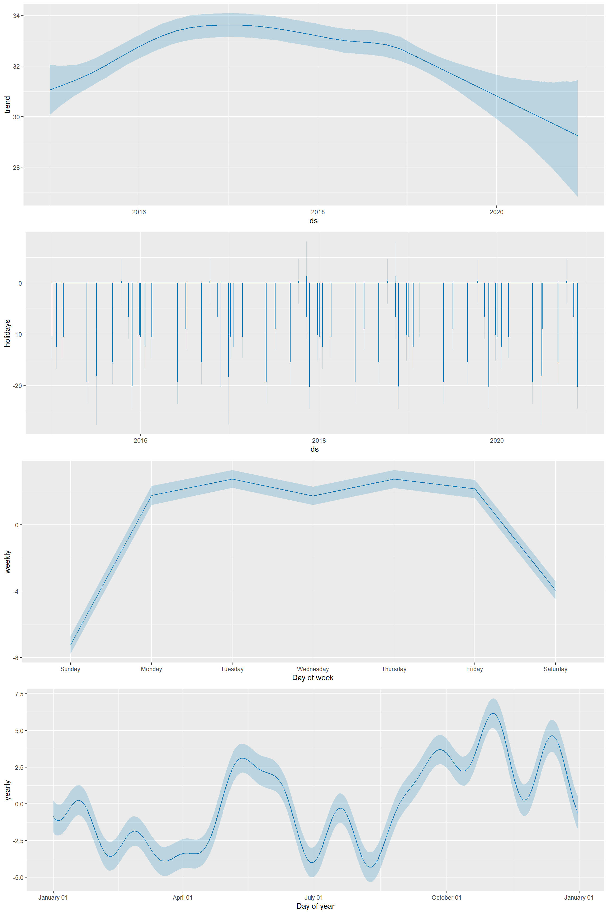
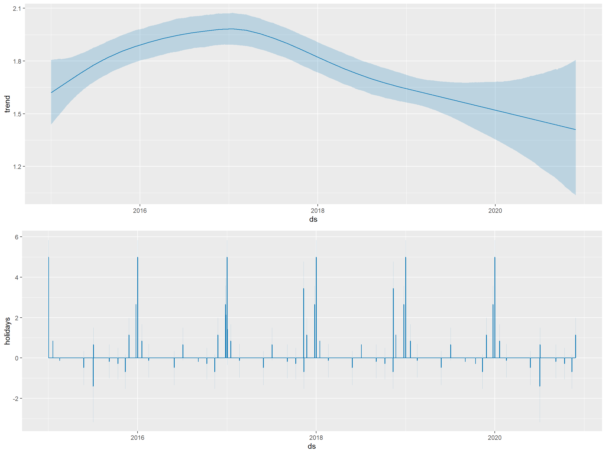
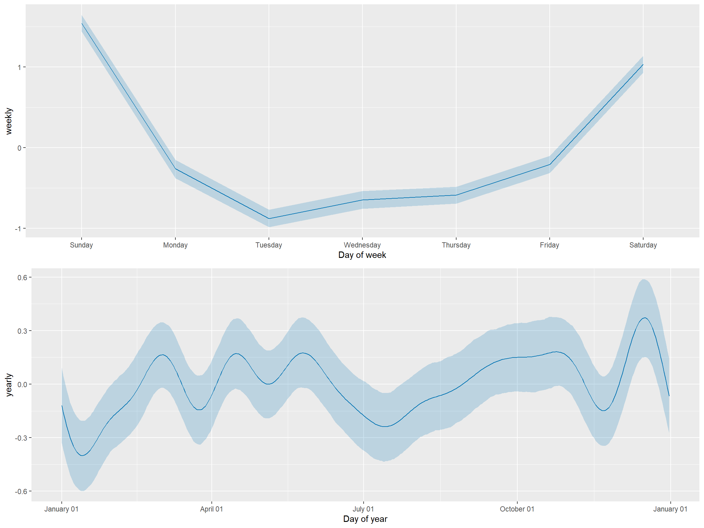
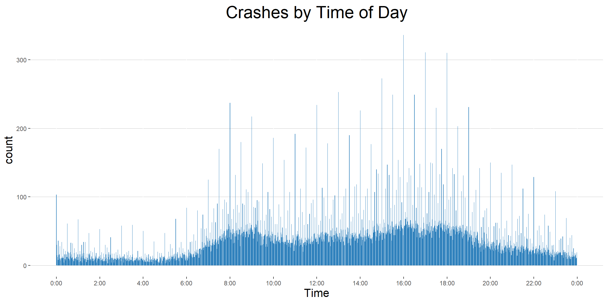
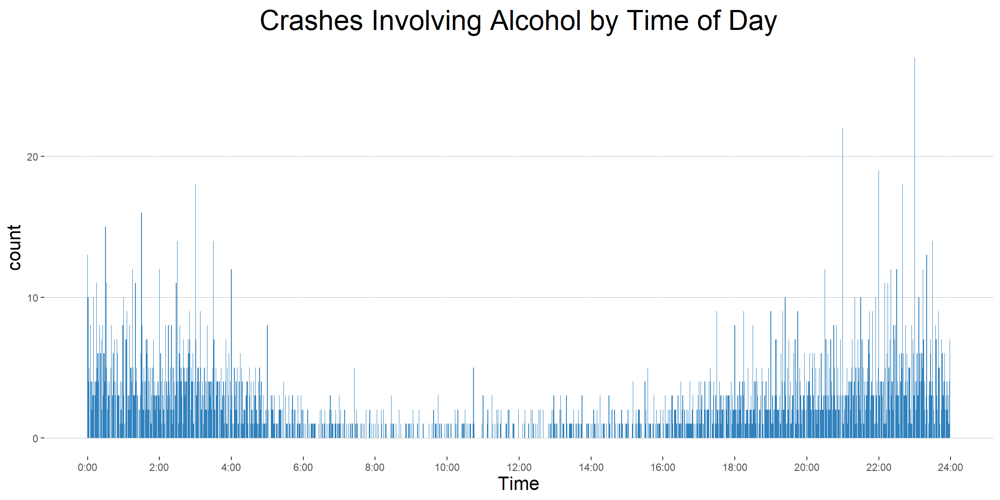
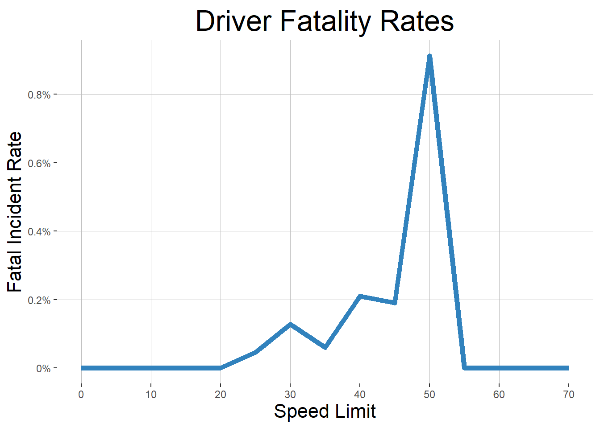

```{r setup, include=FALSE}
knitr::opts_chunk$set(echo = TRUE, fig.width = 10, fig.height = 8, tidy = "styler", df.print = "kable")
```

```{r loading, echo=FALSE, include=FALSE}
library(tidyverse)
library(lubridate)
incidents <- feather::read_feather("incidents.feather")
drivers <- feather::read_feather("drivers.feather")
non_motorists <- feather::read_feather("non_motorists.feather")
single_color <- "#3182bd"
basic_theme <- theme(
  plot.title = element_text(size = 24, vjust = .5, hjust = .5),
  axis.title = element_text(size = 16, hjust = .5, vjust = .5),
  panel.background = element_rect(fill = "white"),
  legend.position = "none",
  panel.grid.major.y = element_line(color = "grey75", size = .1, linetype = "solid")
)
```

# Montgomery County Traffic Incidents

  Automobile Crashes are one of the leading causes of preventable deaths in the United States. Last year, [there were over 40,000 motor vehicle deaths](https://injuryfacts.nsc.org/motor-vehicle/overview/preliminary-estimates/) in the U.S. acording to the National Safety Council. Across the United States and the world, many cities and jurisdictions have begun to use data to find ways to make the roads a safer place. For this project, I wanted to explore the traffic incident data from Montgomery County, to get a better understanding of the problem and identify potential safety issues.

  There are three datasets available on dataMontgomery, Montgomery County's open data platform, from the police department's Automated Crash Reporting System (ACRS). The [incidents](https://data.montgomerycountymd.gov/Public-Safety/Crash-Reporting-Incidents-Data/bhju-22kf), [drivers](https://data.montgomerycountymd.gov/Public-Safety/Crash-Reporting-Drivers-Data/mmzv-x632), and [non-motorists](https://data.montgomerycountymd.gov/Public-Safety/Crash-Reporting-Non-Motorists-Data/n7fk-dce5) datasets form a record of the `r incidents %>% nrow() %>% prettyNum(big.mark=",")` reported traffic collisions in the county since `r incidents %>% pull(incident_date) %>% min() %>% format("%B %d, %Y")`. The datasets contain a variety of information about each traffic collision, including location, time, weather, injuries, property damage, and other factors that may have contributed to the crash. The data reflects preliminary information supplied to the Police Department by the reporting parties, and thus some of the factors, such as distracted driving, are less reliable.

## Forecasting Collisions and Time Related Factors

  One thing that I wanted to explore was the impact of time and time related factors on the volume of crashes. The timestamp associated with each incident was one of the most reliable and consitent fields in the data, so this was an area which particularly well suited for analysis. Using [Prophet](https://facebook.github.io/prophet/), an open source tool from Facebook, I created a model that analyzed seasonal, weekly, and holiday related trends in the data and used those to forecast the number of crashes on any given day in the upcoming year. There was quite a bit of variance in the data that the model was unable to capture, simply due to the complex nature of crashes and the multitude of factors other than time that play a role in crashes. Despite some uncertainty in the predictions, the model was particularly useful for extracting and describing seasonility in the data: trends related to time of year, day of the week, and various holidays. These trends as well as the overall trend in the data can be seen below. 



  The overall trend in reported crash volume has been fairly steady with a slight increase in the two first years of data and a decrease over the past three, roughly returning the trend to the baseline of 31 crashes per day. The holiday related trends are quite noticible and consistent. Nearly every holiday in the dataset has a substantial decrease in the number of reported accidents. Some holidays saw a reduction in the number of expected crashes as large as 20, which is quite substantial, given that the average day saw `r round((nrow(incidents)/(as.integer(max(incidents$incident_date)) - as.integer(min(incidents$incident_date)))))` reported crashes. The weekly trend was fairly simple and expected. There were fewer reported crashes on weekends than on weekdays. The yearly trend was a bit more complicated and variable, but there were noticible spikes in the number of reported crashes in May and June as well as at the end of the year.

## Forecasting Alchohol Related Collisions and Time Related Factors

  I had wanted to look at the impact and prevalance of Alcohol in the data. [Drunk driving results in over 10,000 fatalities nationwide each year](https://www.nhtsa.gov/risky-driving/drunk-driving), approximately 25% of motor vehicle deaths nationwide. `r incidents %>% filter(str_detect(driver_substance_abuse,"ALCOHOL")) %>% nrow()` of the crashes in the data involved a driver who had been drinking. After filtering the data to only include these alcohol related crashes, I built another model using Prophet to forecast the number of alcohol related crashes on a given day.





  The results of this model stand in stark contrast to the model that I built for crashes as a whole. The overall trend looks similar: increases in 2015 and 2016 followed by decreases in 2017, 2018, and 2019. The holiday related trend in alcohol related crashes is nearly the opposite of the overall trend. Most holidays had an increase in the number of drunk driving crashes. The weekly trend in acohol related crashes was also flipped from the overall weekly trend. Weekends corresponded to a substantial increase in the number of incidents involving alcohol. The yearly trend looks fairly similar to that of the overall yearly trend.

## Time of Day

  Another thing that I looked into was the time of day at which crashes were reported. The trend here was mostly what I expected. Most crashes occur at the times you would expect people to be on the roads the most. There are far more crashes during the day than overnight, and there are two peaks corresponding to morining and evening rush hours. There is also a tendency for crashes to be reported on the nearest five or ten minute marker.



  Like we saw before, the trend for alcohol related crashes is nearly the opposite of that for crashes as a whole. Alchohol related crashes during daylight hours are quite rare, with the overwhelming majority of alcohol related crashes ocurring between 5PM and 5AM. 



## Speed Limits

  I also looked at speed limits and their possible impact on crash outcomes, particularly focussing on fatalities. Surprisingly, there was little relationship between a road's speed limit and the proportion of crashes on that road which ended in a drivers death, with one glaring exception. 0.8% of crahes on roads which had a speed limit of 50 miles per hour resulted in a driver fatality. This is four times higher than the rate of any other speed limit in the county. When I ran a [proportion test](http://sphweb.bumc.bu.edu/otlt/MPH-Modules/BS/R/R6_CategoricalDataAnalysis/R6_CategoricalDataAnalysis6.html), on all speed limit groups excluding 50 MPH, the difference in fatalities was not statistically significant. This changed, and the resluts became significant when the 50 mph group was included. Another interesting thing that I noticed was that 55 mile per hour roads were among the safest in the county and actually had no driver fatalities over the nearly five years of data. This is likely because they tend to be major freeways with safety features that other roads don't typically have.



## Further Work

  This was a somewhat tricky dataset to work with, but I feel that there is a lot more that can be done with it. This project was particulalry difficult because I was unable to find data about traffic volume and patterns on county roads. A lot more would be possible with this kind of baseline data. [This study](https://gduer.github.io/Collision-Prediction-in-Louisville-KY/) from Louisville, Kentucky used traffic data from Google and Waze in addition to similar traffic collision data to build predictive models and identify roads which had more crashes than expected based on the volume of traffic.